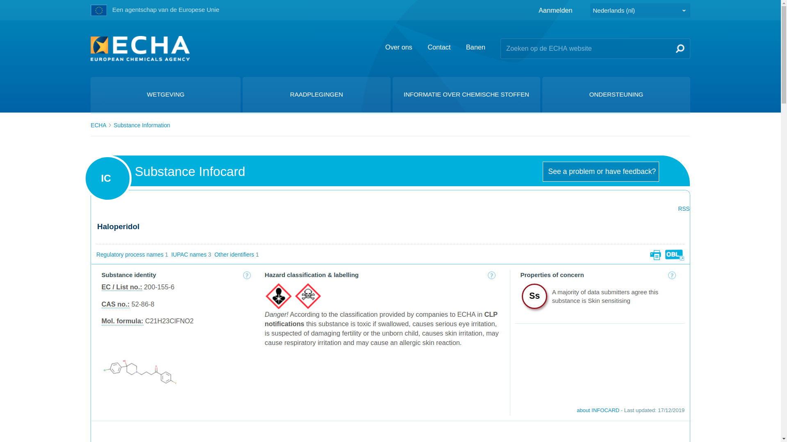
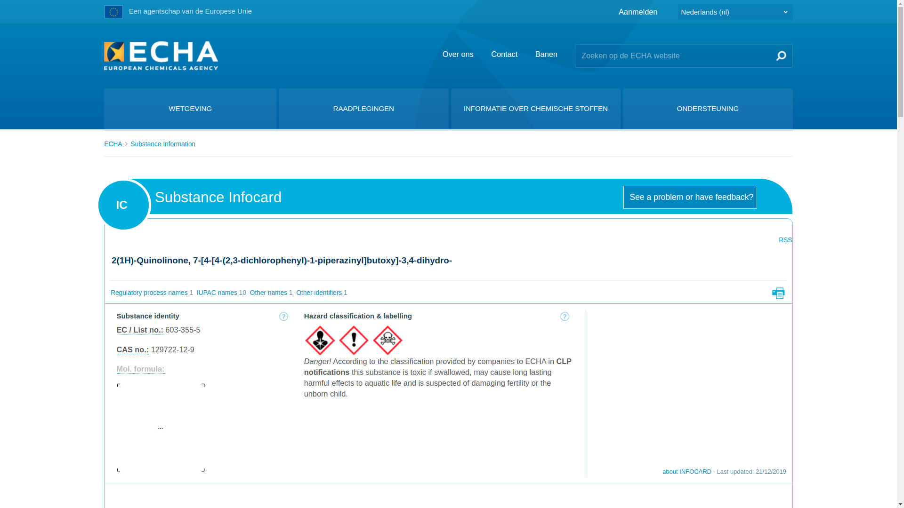

.. _evidence:

.. raw:: html

      

.. title:: Evidence

.. raw:: html

    
<b>EVIDENCE</b>
 

.. raw:: html

   

The website of the **ECHA** <European Chemical Agency> has been updated in January 2026 and no longer shows a skull and bones when
:ref:`visited <echa>`. Images shown here are from 2019.

.. raw:: html

   

.. _haldol:

**HALDOL**

.. raw:: html

   

.. raw:: html

    

.. _clozapine:

**CLOZAPINE**

.. raw:: html

   

.. image:: ECHAclozapine.png
    :width: 100%

.. raw:: html

    

.. _zyprexa:

**ZYPREXA**

.. raw:: html

   

.. image:: ECHAzyprexa.png
    :width: 100%

.. raw:: html

    

.. _abilify:

**ABILIFY**

.. raw:: html

   

