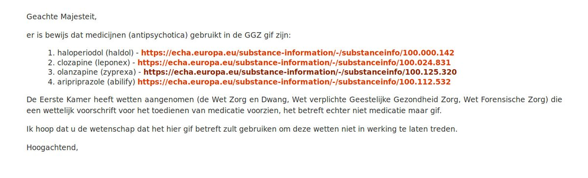
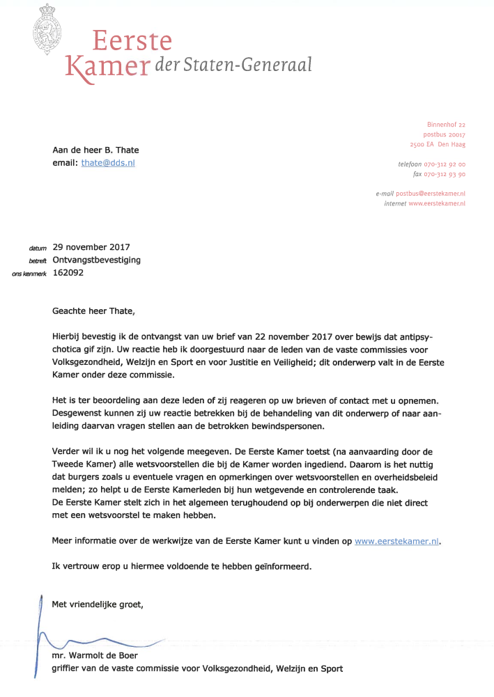
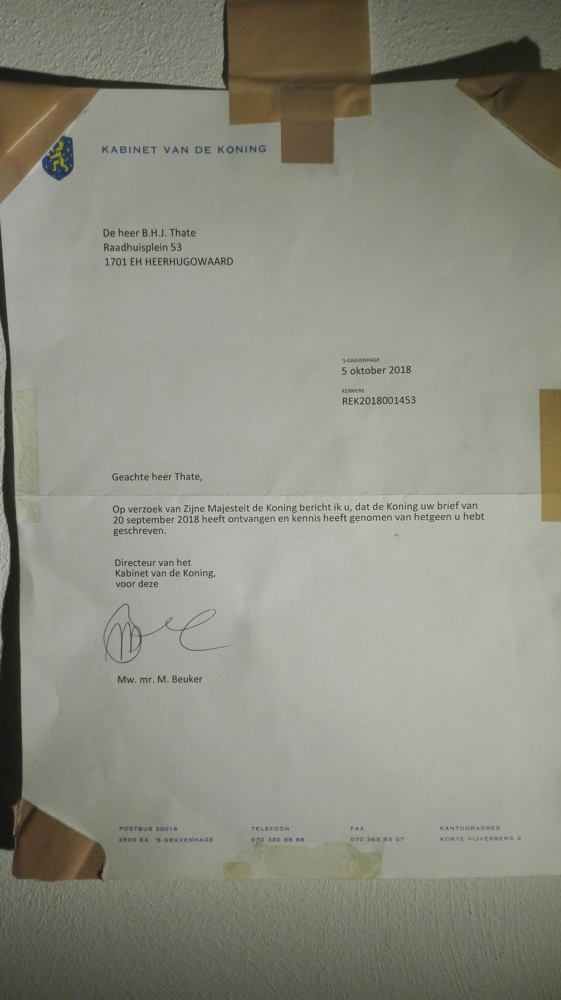

.. _guilty:

.. raw:: html

    

.. title:: Guilty

.. raw:: html

    
<b>GUILTY</b>
 

.. _informed:

**INFORMED**

.. raw:: html

     

.. raw:: html

     

**(*)** Since January 2026 the **ECHA** <European Chemical Agency> no longer shows a skull and bones when :ref:`visited <echa>`. 2019 versions are :ref:`here
<evidence>`.

.. raw:: html

     

.. _chamber:

**CHAMBER**

.. raw:: html

     

.. raw:: html

     

.. _king:

**KING**

.. raw:: html

     

.. raw:: html

   
